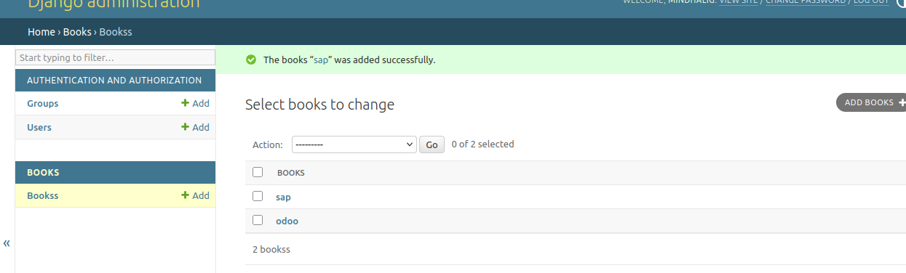
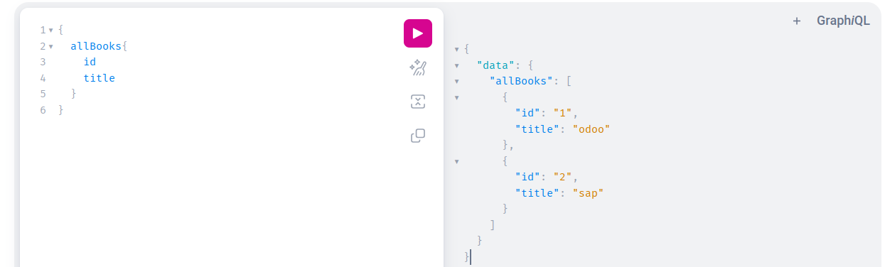

# GraphQL Sederhana dengan Django

Proyek ini adalah contoh sederhana penerapan **GraphQL** menggunakan **Django**.

## 📋 Daftar Isi

1. 🔁 [Recap REST](#1-rest-recap)  
2. 📚 [Overview GraphQL](#2-graphql-overview)  
3. ⚙️ [Setup Django ke GraphQL](#3-django---graphql-setup)  
4. 📤 [Mengembalikan Data dengan GraphQL](#4-return-data-with-graphql)

---

## 1. REST Recap

Penjelasan singkat tentang bagaimana REST API bekerja dan keterbatasannya (misalnya: overfetching dan underfetching data).

---

## 2. GraphQL Overview

GraphQL memungkinkan klien untuk menentukan data apa saja yang mereka butuhkan. Lebih efisien dan fleksibel dibanding REST.

---

## 3. Django → GraphQL Setup

Langkah-langkah mengintegrasikan GraphQL ke dalam proyek Django menggunakan `graphene-django`.

---

## 4. Return Data with GraphQL

Contoh query GraphQL dan bagaimana data dikembalikan dari Django.

---

## 🛠️ Django Administration

Tampilan antarmuka admin Django:

---

## 🔍 GraphQL Playground

Contoh antarmuka GraphiQL untuk mencoba query secara langsung:

